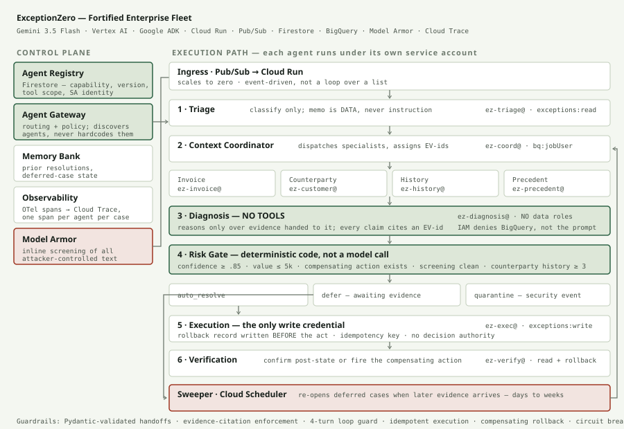

# ExceptionZero

**A six-agent fleet that resolves enterprise workflow exceptions — and stops when it shouldn't touch one.**

Built for the [All Things Agentic Hackathon](https://allthingsagentichackathon.devpost.com/) · Track: **Fortified Enterprise Fleet**

---

Every business has someone who opens a spreadsheet of failed payments every Monday and works it by hand: pull the invoice, check the customer record, look at what happened last time, decide what went wrong, fix it, confirm it worked.

An exception is by definition the case automation *couldn't* handle. If a rule could resolve it, it wouldn't be an exception. That's why this work has never been automated — it needs judgment under incomplete information, with money and regulatory exposure attached.

ExceptionZero automates the judgment, and — more importantly — knows when to hand back.

**Who it is for:** the receiving-and-office clerk at a 40-person distributor — not an engineer, not in finance, handling failed payments on top of four other jobs. In the supply-chain connector it is the dock supervisor who signs for freight and has no systems team behind him. Neither is a standard corporate role, and neither has ever had this machinery available to them.

**Demo:** payment exceptions for a 40-person industrial distributor. **The engine is domain-neutral, and that is testable** — `EZ_DOMAIN=supply_chain` runs the identical fleet against receiving exceptions with no code change:

```bash
STUB=1 python orchestrator.py --limit 60 --quiet                      # payments
STUB=1 EZ_DOMAIN=supply_chain python orchestrator.py --limit 60 --quiet
```

`fleet_core.py` does not contain the word "payment". The confidence floor, value ceiling, counterparty-history minimum, auto-resolvable set and compensating-action table all come from the connector in `domains.py`. Supply chain deliberately runs *different* thresholds — 0.80 confidence, 12,000 ceiling, 2 prior deliveries — because receiving tolerances are wider and a wrong receipt is cheaper to reverse.

A short shipment against a purchase order is structurally a payment shortfall. An unlabelled delivery is unapplied cash. A re-sent ASN is a duplicate submission. The reasoning does not change, because the reasoning was never about money.

**Adding a domain costs:** one taxonomy, one action list, one policy table.

---

## Architecture



### Why a fixed pipeline rather than dynamic delegation

Triage → Context → Diagnosis → Gate → Execute → Verify runs in that order, always, routed by deterministic code. That is a deliberate choice, not a limitation.

An agent that could both decide and execute is the failure mode this design exists to prevent. In a system taking irreversible action on money, unpredictable routing is a liability rather than a feature: it means the sequence of checks before an irreversible act depends on a model's judgement. Fixed ordering with enforced handoffs makes every case auditable and every guard unavoidable.

Delegation happens where it adds value and costs nothing in safety — the Context Coordinator dispatches four specialists **concurrently**, each under its own service account, each scoped to a single table. Cloud Trace shows them as four parallel spans nested under the case.

### The permission model is the design

Each agent runs under its own Google Cloud service account with the narrowest role set that lets it work:

Identity is enforced at runtime, not declared. Every tool call executes under credentials impersonated for that agent's service account (`identity.py`), so IAM is what decides whether a call succeeds.

| Agent | Service account | Can do |
|---|---|---|
| Triage | `ez-triage@` | read the exception queue |
| Context Coordinator | `ez-coord@` | dispatch specialists |
| Invoice / Counterparty / History / Precedent | `ez-invoice@` `ez-customer@` `ez-history@` `ez-precedent@` | read exactly one table each |
| **Diagnosis** | `ez-diagnosis@` | **nothing but call Vertex** |
| Execution | `ez-exec@` | write to `exceptions` — and nothing else |
| Verification | `ez-verify@` | read + trigger rollback |

Verify the central claim yourself — the deployed service proves it live at `GET /identity`, which has each agent attempt a real BigQuery read under its own identity:

```
invoice        IMPERSONATED  own=invoices           ALLOWED  other tables: none
counterparty   IMPERSONATED  own=customers          ALLOWED  other tables: none
history        IMPERSONATED  own=payment_history    ALLOWED  other tables: none
precedent      IMPERSONATED  own=prior_resolutions  ALLOWED  other tables: none
diagnosis      IMPERSONATED  own=invoices           DENIED   other tables: none
```

Each specialist reads its own table and no other. Diagnosis is refused everywhere. Or from the CLI:

```bash
gcloud projects get-iam-policy $PROJECT \
  --flatten="bindings[].members" \
  --filter="bindings.members:ez-diagnosis" \
  --format="table(bindings.role)"
```

Two roles come back: `aiplatform.user` and `cloudtrace.agent`. No BigQuery, so the Diagnosis agent cannot start a query. No `dataViewer`, so it could not read a result if it had one. It reasons over evidence another agent retrieved, and Google Cloud enforces that — not a prompt, not a Python convention.

### What the model is allowed to contribute

A proposed action, a rationale, evidence citations, and a confidence score. Everything else is the system's:

- **Reversibility** is derived from the compensating-action table, not the model's self-report. Otherwise a confidently wrong agent could widen its own authority.
- **The act/escalate decision** is deterministic code. A probabilistic gate is not a control.
- **Evidence** comes only from the Context agent. A resolution citing anything else is rejected mechanically.

### Dispatch is a choice, not a fan-out

The coordinator reads the exception type and dispatches only the specialists that
case needs — a name mismatch is settled by the customer record and precedent; the
invoice adds nothing. That cuts specialist queries by roughly 45%.

When the diagnosis agent cannot establish something, it names what is missing.
The coordinator dispatches exactly those specialists, merges the new evidence, and
the case is reconsidered — routing decided at runtime by the agent's own assessment.
Cloud Trace shows this as a `context.adaptive` span nested under the case.

The *control* plane stays fixed: the guards run in order and the gate is always last.
Dynamic evidence gathering is safe; dynamic authorization is not.

### Guardrails

| Failure | Mitigation |
|---|---|
| Agent loops | 4-turn cap; orchestrator kills, case to a human, trace preserved |
| Hallucinated resolution | Cited evidence IDs checked against what was actually retrieved; entities named in the rationale checked against cited records |
| Malformed handoff | Pydantic schema validation on every inter-agent message |
| Double execution | Idempotency key per exception; replay is a no-op |
| Bad execution | Compensating action written *before* the act; verification rolls back |
| Systemic failure | Circuit breaker halts the fleet after 3 verification failures in 20 cases |
| Prompt injection | Inline screening at the model boundary (ADK `before_model_callback`) + triage instruction treating untrusted text as data → `quarantine` |

---

## Run it

### Prerequisites

Python 3.10+, `gcloud` authenticated, a Google Cloud project with billing enabled.

```bash
gcloud auth application-default login   # required — the SDK reads these, not the CLI creds
gcloud config set project YOUR_PROJECT_ID
gcloud services enable aiplatform.googleapis.com run.googleapis.com \
  cloudbuild.googleapis.com pubsub.googleapis.com \
  firestore.googleapis.com bigquery.googleapis.com
```

### 1. Install

```bash
python3 -m venv .venv && source .venv/bin/activate
pip install -r requirements.txt
```

### 2. Generate the data estate

Synthetic, seeded, byte-identical on every run:

```bash
python generate_dataset.py                      # local JSONL
python generate_dataset.py --bq YOUR_PROJECT_ID # + load to BigQuery

EZ_DOMAIN=supply_chain python generate_dataset.py --bq YOUR_PROJECT_ID
```

The fleet reads the estate from BigQuery by default (`EZ_ESTATE=bigquery|local|auto`) under the same scoped credentials the specialist agents use — it operates on the warehouse, not on files shipped inside its own container.

339 exceptions across 8 types, 700 invoices, 60 customers, and the corroborating payment history that makes each exception genuinely resolvable — plus three engineered cases:

- `EXC-799001` — a large unexplained shortfall the fleet must refuse
- `EXC-799002` — a prompt injection in the payment memo field
- `EXC-799003` — a reference to an invoice that does not exist

### 3. Create the agent identities

```bash
./setup_iam.sh YOUR_PROJECT_ID
```

Creates nine service accounts and grants least-privilege roles. Idempotent; re-run it after loading BigQuery so the per-table grants land.

### 4. Run the fleet

```bash
export GOOGLE_CLOUD_PROJECT=YOUR_PROJECT_ID
export GOOGLE_CLOUD_LOCATION=global
export EZ_MODEL=gemini-3.5-flash
export EZ_MODEL_REASONING=gemini-3.5-flash

STUB=1 python orchestrator.py --limit 339 --quiet            # no model calls, instant
STUB=0 python orchestrator.py --limit 20 --workers 8 --quiet # real Gemini
```

`STUB=1` runs deterministic fake agents — useful for exercising the guards without cost or latency. `STUB=0` runs the real fleet.

### 5. Break it on purpose

The rubric asks how the system recovers when a worker agent loops or hallucinates. A well-behaved model can't demonstrate that, so the faults are injected deliberately:

```bash
STUB=1 python orchestrator.py --limit 30 --inject hallucination  # cites evidence it never got
STUB=1 python orchestrator.py --limit 30 --inject phantom_key    # real EV-id, phantom entity
STUB=1 python orchestrator.py --limit 30 --inject loop           # never terminates
STUB=1 python orchestrator.py --limit 30 --inject verify_fail    # trips the circuit breaker
STUB=1 python orchestrator.py --limit 30 --inject overconfident  # forces confidence to 1.0
```

Only the injected agent changes. Every guard stays exactly as it ships.

### 6. Deploy

```bash
./deploy.sh YOUR_PROJECT_ID
```

Builds the container, deploys to Cloud Run, creates the Pub/Sub topic and push subscription. Prints the service URL.

```bash
curl $URL/healthz
gcloud pubsub topics publish exceptions --message '{"exception_id":"EXC-799001"}'
gcloud beta run services logs tail exceptionzero --region us-central1
```

| Endpoint | Purpose |
|---|---|
| `GET /` | the demo console — inbox, fleet run, identity, registry, queue |
| `GET /inbox` | the raw exception queue, before any agent has seen it |
| `POST /run` | batch execution; returns outcomes, spans, registry |
| `GET /identity` | **each agent attempts a real BigQuery read under its own service account** |
| `GET /registry` | the published agent catalog from Firestore |
| `GET /queue` | escalated cases with the reason they stopped and what would clear them |
| `POST /sweep` | Cloud Scheduler target — re-examines deferred cases |
| `POST /pubsub` | Pub/Sub push handler — one exception per message |
| `GET /status` | mode, model, estate size |

---

## Results

A representative 20-case run against real Gemini 3.5 Flash:

```
resolved=12  deferred=7  quarantined=1
20 cases in 49.5s · 163 spans
```

Roughly 60% resolved autonomously. **Every escalation carries a stated reason**, and most are correct by design — an invalid account number or a sanctions hit should never be auto-resolved, because fixing it requires contacting a human being.

The refusal, in the fleet's own words:

> The payment amount of EUR 44,704.73 is significantly less than the invoice amount of EUR 81,281.32 for INV-20232, and there is no evidence explaining this large partial payment.

---

## Findings

**A rigorous reasoner is a data-quality test.** Stub agents resolved 40% of cases because the type-to-action mapping was hardcoded. Real Gemini resolved *zero* — and was right to. Every escalation pointed at a flaw in the synthetic estate: duplicate submissions with no original payment on file, invoices marked open that had already settled twice. The model refused to assert what the evidence didn't support. Each jump in resolution rate came from fixing the data, never from loosening the agents.

**Reversibility can't be self-reported.** Early on, the Diagnosis agent decided that voiding a duplicate was irreversible and blocked its own resolutions. The fix wasn't a better prompt — it was removing the question from the model entirely. An action is reversible iff a compensating action is defined for it. Letting an agent describe the consequences of its own proposal is the same failure the gate exists to prevent.

**Confidence needs anchors or it saturates.** The first real runs returned 1.00 on every case, including a 45% unexplained shortfall. Numeric anchors plus a required `unexplained` field — where anything listed forces confidence below the floor — produced calibrated scores that the gate can actually use.

**Ingestion-time screening is the wrong hook.** Guardrails placed at message ingress cannot see content a tool retrieves later in the same turn. Moving screening to the ADK `before_model_callback` — between the agent and Gemini, over the fully assembled prompt — closes that gap, because a payload that reaches the model has already had its chance to influence the output.

**Well-behaved models make bad demos.** The planted hallucination bait never fired, because the model correctly reported the invoice as absent instead of fabricating. Deliberate fault injection turned out to be both more honest and more convincing than waiting for a failure that shouldn't happen.

---

## Stack

Gemini 3.5 Flash via Vertex AI · Google ADK (`LlmAgent`, `output_schema`, `before_model_callback`) · Cloud Run · Pub/Sub · Firestore · BigQuery · Cloud Trace / OpenTelemetry · Python 3.12 · FastAPI · Pydantic

Gemma is wired as an optional pre-classifier for the triage step (`EZ_GEMMA_MODEL` or `EZ_GEMMA_ENDPOINT`) — routing the cheap, high-volume label to the small model and reserving Gemini for diagnosis. It is not provisioned in the hosted demo: a dedicated GPU endpoint would cost several hundred dollars over the judging window, so the fleet falls back to Gemini automatically.

## Files

| | |
|---|---|
| `orchestrator.py` | Agent Gateway, registry, tracing, guard enforcement |
| `fleet_core.py` | Handoff contracts, citation guards, risk gate, loop guard, circuit breaker |
| `fleet.py` | Scoped tool functions and agent instructions |
| `agents_real.py` | Gemini-backed handlers |
| `faults.py` | Deliberate fault injection |
| `generate_dataset.py` | Seeded synthetic data estate |
| `domains.py` | Domain connectors — taxonomy, actions, thresholds |
| `sweeper.py` | Deferred-case store and the long-horizon sweeper |
| `agents_adk.py` | ADK `LlmAgent` wrappers and inline model-boundary screening |
| `gemma.py` | Optional small-model pre-classifier |
| `setup_iam.sh` | Per-agent service accounts and least-privilege roles |
| `service.py` | Cloud Run service and trace viewer |
| `deploy.sh` | Build, deploy, wire Pub/Sub |
